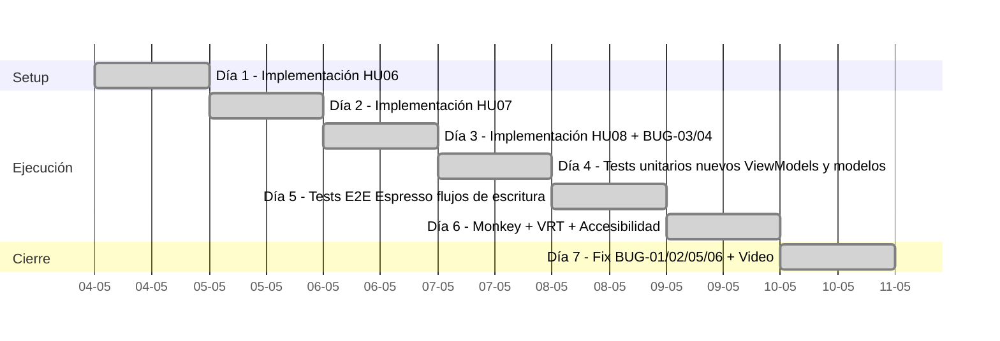

# Wiki — Iteración 3 (Sprint 3)

## APK listo para instalar

### Release v1.0.6

Publicado automáticamente por el pipeline CI.

| Campo | Valor |
|---|---|
| **Tag** | `v1.0.6` |
| **Publicado** | 17 de Mayo 2026 |
| **Release URL** | [github.com/martzb/vinilos-movile-app/releases/tag/v1.0.6](https://github.com/martzb/vinilos-movile-app/releases/tag/v1.0.6) |
| **APK firmado** | `app-release.apk` (5.71 MB) |
| **Generado por** | github-actions[bot] |

---

### Release v1.0.5

Publicado automáticamente por el pipeline CI.

| Campo | Valor |
|---|---|
| **Tag** | `v1.0.5` |
| **Publicado** | 10 de Mayo 2026 |
| **Release URL** | [github.com/martzb/vinilos-movile-app/releases/tag/v1.0.5](https://github.com/martzb/vinilos-movile-app/releases/tag/v1.0.5) |
| **APK firmado** | `app-release.apk` (5.71 MB) |
| **Generado por** | github-actions[bot] |

---

## Tareas del Sprint

### HU06 – Ver detalle de coleccionista
| # | Tarea | Responsable | Sprint |
|---|---|---|---|
| 21 | Crear fragmento de detalle de coleccionista | Brian | Sprint 3 |
| 22 | Mostrar álbumes y artistas favoritos del coleccionista | Brian | Sprint 3 |
| 23 | Mostrar gustos musicales del coleccionista | Ruben | Sprint 3 |
| 24 | Ejecutar pruebas E2E de la vista de detalle de coleccionista | Ruben | Sprint 3 |

### HU07 – Crear un álbum
| # | Tarea | Responsable | Sprint |
|---|---|---|---|
| 25 | Crear formulario de registro de álbum | Diego | Sprint 3 |
| 26 | Validar campos obligatorios del formulario | Diego | Sprint 3 |
| 27 | Consumir endpoint POST /albums | David | Sprint 3 |
| 28 | Ejecutar pruebas E2E de la creación de álbum | David | Sprint 3 |

### HU08 – Asociar tracks a álbum
| # | Tarea | Responsable | Sprint |
|---|---|---|---|
| 29 | Crear formulario de registro de tracks | Brian | Sprint 3 |
| 30 | Asociar track a un álbum existente | Brian | Sprint 3 |
| 31 | Consumir endpoint POST /albums/{id}/tracks | David | Sprint 3 |
| 32 | Ejecutar pruebas E2E de la asociación de tracks | David | Sprint 3 |

### Tabla de las 8 HU del proyecto

| HU | Descripción | Sprint | Fragmento principal |
|---|---|---|---|
| HU01 | Consultar catálogo de álbumes | Sprint 1 | `AlbumFragment` |
| HU02 | Ver detalle de álbum | Sprint 1 | `AlbumDetailFragment` |
| HU03 | Consultar listado de artistas | Sprint 2 | `MusicianFragment` |
| HU04 | Ver detalle de artista | Sprint 2 | `MusicianDetailFragment` |
| HU05 | Consultar coleccionistas | Sprint 2 | `CollectorFragment` |
| HU06 | Ver detalle de coleccionista | **Sprint 3** | `CollectorDetailFragment` |
| HU07 | Crear un álbum | **Sprint 3** | `CreateAlbumFragment` |
| HU08 | Asociar tracks a álbum | **Sprint 3** | `CreateTrackFragment` |

---

## Diseño Arquitectónico

La aplicación sigue el patrón **MVVM (Model-View-ViewModel)** con arquitectura de capas limpia:

```
UI Layer         → Fragments + Adapters  (solo lógica de presentación)
ViewModel Layer  → ViewModels           (estado + validación + orquestación)
Repository Layer → Repositories         (fuente única de verdad de datos)
Data Layer       → Retrofit + Modelos   (API REST)
```

### Nuevos componentes del Sprint 3

| Componente | Tipo | HU | Descripción |
|---|---|---|---|
| `CollectorDetailFragment` | Fragment | HU06 | Vista de detalle con nombre, contacto, álbumes favoritos (`rvAlbums`) y artistas favoritos (`rvPerformers`) |
| `CollectorDetailViewModel` | ViewModel | HU06 | Carga el coleccionista y filtra sus álbumes desde `GET /albums` cruzando con `collectorAlbums` |
| `AlbumCarouselAdapter` | Adapter | HU06 | RecyclerView horizontal para álbumes favoritos del coleccionista |
| `PerformerCarouselAdapter` | Adapter | HU06 | RecyclerView horizontal para artistas favoritos del coleccionista |
| `CreateAlbumFragment` | Fragment | HU07 | Formulario con DatePicker, dropdowns de género y sello, selector de portada vía galería |
| `CreateAlbumViewModel` | ViewModel | HU07 | Valida campos con `validateFields()`, carga músicos vía `GET /musicians`, ejecuta `POST /albums` |
| `AlbumFormValidation` | Data class | HU07 | Estado de validación campo a campo; `isValid` es `true` cuando todos los errores son `null` |
| `CreateTrackFragment` | Fragment | HU08 | Formulario de nombre y duración con autoformato `MM:SS` vía `TextWatcher` |
| `CreateTrackViewModel` | ViewModel | HU08 | Carga el álbum con `fetchAlbum()`, ejecuta `POST /albums/{id}/tracks`, actualiza la lista local reactivamente |
| `AddedTrackAdapter` | Adapter | HU08 | ListAdapter que muestra los tracks ya añadidos al álbum en tiempo real |
| `FragmentDialogExt` | Extension fun | HU07/HU08 | Función de extensión `Fragment.showSuccessDialog()` compartida entre `CreateAlbumFragment` y `CreateTrackFragment` |

### Flujo de datos — HU07 Crear álbum

```
CreateAlbumFragment
  ┌─ usuario llena campos
  └─ btnSave.click() → viewModel.submitAlbum(AlbumFormData)
       ├─ validateFields() → AlbumFormValidation
       │    ├─ isValid = false → _validationState emite errores → Fragment muestra error en cada tilXxx
       │    └─ isValid = true  → createAlbum()
       │         └─ albumRepository.createAlbum(AlbumRequest) → POST /albums
       │              ├─ éxito  → _isSuccess = true → showSuccessDialog() → navigateUp()
       │              └─ error  → _error emite mensaje → Toast en Fragment
```

### Flujo de datos — HU08 Asociar track

```
CreateTrackFragment
  ┌─ onViewCreated() → viewModel.fetchAlbum(albumId) → GET /albums/{id}
  │    └─ _album y _tracks expuestos → Fragment muestra portada, nombre, artista y lista de tracks
  └─ btnSubmit.click()
       ├─ validación local (nombre vacío, duración no cumple regex \d{2}:\d{2})
       └─ viewModel.createTrack(albumId, name, duration)
            └─ albumRepository.createTrack(albumId, TrackRequest) → POST /albums/{id}/tracks
                 ├─ éxito → track se agrega a _tracks (lista reactiva) → showSuccessDialog()
                 └─ error → _error emite mensaje → Toast
```

### Flujo de datos — HU06 Detalle de coleccionista

```
CollectorDetailFragment
  └─ onViewCreated() → viewModel.getCollectorDetail(collectorId)
       ├─ collectorRepository.getCollector(id) → GET /collectors/{id}
       │    └─ _collector.value = fetchedCollector
       │         ├─ nombre, email, teléfono, avatar (pravatar) → UI
       │         └─ favoritePerformers → performerAdapter.submitList()
       └─ si collectorAlbums no vacío:
            albumRepository.getAlbums() → GET /albums
            filtrar por collectorAlbums.map { it.id }
            └─ _albums.value → albumAdapter.submitList()
```

---

## Artefactos de Prueba

### Inventario de Tests — Sprint 3

#### Tests Unitarios (JVM)

| Archivo de test | Qué cubre | Tests |
|---|---|---|
| `CreateAlbumViewModelTest` | `loadMusicians` exitoso/error/recarga, `validateFields` para cada campo (nombre, artista, fecha, sello, género, descripción), `submitAlbum` válido/inválido/error-red, `isLoading`, `resetSuccess`, verificación del request enviado al repositorio, cover placeholder | 21 |
| `CreateTrackViewModelTest` | `fetchAlbum` exitoso/error/sin-tracks, `createTrack` exitoso/agrega-a-lista/error, llamada correcta al repositorio, `resetSuccess` | 8 |
| `CollectorDetailViewModelTest` | Carga exitosa, coleccionista sin álbumes → lista vacía, coleccionista con álbumes → filtra por IDs, error de red, `isLoading` false tras completar | 5 |
| `AlbumCarouselAdapterTest` | `DiffCallback.areItemsTheSame` y `areContentsTheSame` | 4 |
| `CollectorAlbumModelTest` | Data class `CollectorAlbum` — valores correctos, igualdad, desigualdad por id, `toString` | 4 |
| `TrackRequestModelTest` | Data class `TrackRequest` — valores correctos, igualdad, desigualdad por nombre, `toString` | 4 |
| `AlbumDisplayUtilsTest` *(existente)* | `extractArtistName` y `resolveArtistForRecent` | 8 |
| `AlbumViewModelTest` *(existente)* | Carga, error, recarga, detalle de álbum | 6 |
| `MusicianViewModelTest` *(existente)* | `MusicianViewModel` + `MusicianDetailViewModel` | 8 |
| `CollectorViewModelTest` *(existente)* | Carga, error, recarga, lista vacía | 6 |
| `RepositoryTest` *(existente)* | `AlbumRepository`, `MusicianRepository`, `CollectorRepository` | 8 |
| `AlbumRecentAdapterTest` *(existente)* | `DiffCallback` | 4 |
| `AlbumTrendingAdapterTest` *(existente)* | `DiffCallback` | 4 |
| `TrackAdapterTest` *(existente)* | `TrackDiffCallback` | 4 |
| `CollectorAdapterTest` *(existente)* | `DiffCallback` | 5 |
| `MusicianAdapterTest` *(existente)* | `DiffCallback` | 5 |
| `AlbumModelTest` *(existente)* | Data class `Album` | 6 |
| `MusicianModelTest` *(existente)* | Data class `Musician` | 6 |
| `CollectorModelTest` *(existente)* | Data class `Collector` | 5 |
| `PerformerModelTest` *(existente)* | Data classes `Performer` y `Track` | 7 |

**Total unitarios: 128 tests**

---

### Script / Casos de Prueba en Espresso

Las pruebas instrumentadas E2E cubren los 3 flujos nuevos del Sprint 3.

#### AlbumCreateScreenTest — 4 casos

Navega: `card_collector` → espera carga → `fab_add` → formulario de creación.

| Método de test | Qué verifica |
|---|---|
| `emptyFieldsShowErrors()` | Pulsar `btnSave` sin datos muestra `"Campo requerido"` en los 6 `TextInputLayout` (nombre, artista, fecha, sello, género, descripción) |
| `invalidDateShowsError()` | Fecha escrita a mano sin pasar por DatePicker (sin tag ISO) muestra `"Selecciona una fecha válida"` |
| `validAlbumShowsSuccessDialog()` | Formulario completo con tag ISO válido → `POST /albums` exitoso → diálogo con `"Ver álbum →"` |
| `missingDescriptionShowsError()` | Todos los campos válidos excepto descripción → muestra `"Campo requerido"` en `tilDescription` |

```kotlin
// Fragmento representativo — verifica el diálogo de éxito
onView(withText("Ver álbum →"))
    .inRoot(isDialog())
    .check(matches(isDisplayed()))
```

#### TrackCreateScreenTest — 4 casos

Navega: `card_visitor` → primer álbum en `rv_trending` → `fabAddTrack` → formulario de track.

| Método de test | Qué verifica |
|---|---|
| `emptyNameShowsError()` | Duración válida pero nombre vacío → `etTrackName` muestra `"Campo requerido"` |
| `invalidDurationShowsError()` | Duración `"345"` (sin `:`) → `etTrackDuration` muestra `"Formato inválido (mm:ss)"` |
| `validTrackShowsSuccessDialog()` | Nombre + duración `"03:45"` → diálogo con `"Ver álbum →"` |
| `recyclerViewShowsAddedTrack()` | Nombre + duración → submit → diálogo muestra `"¡Track agregado!"` y `"Ver álbum →"` |

```kotlin
// Fragmento representativo — verifica el autoformato MM:SS y el diálogo
onView(withId(R.id.etTrackDuration))
    .perform(replaceText("03:45"), closeSoftKeyboard())
onView(withId(R.id.btnSubmit)).perform(click())
onView(withText("¡Track agregado!")).inRoot(isDialog()).check(matches(isDisplayed()))
```

#### CollectorDetailScreenTest — 3 casos

Navega: `card_visitor` → pestaña `collectorFragment` → primer item de `rv_collectors` → detalle.

| Método de test | Qué verifica |
|---|---|
| `e2e_collectorDetail_showsCollectorInfo()` | `tvCollectorName` y `tvCollectorContact` visibles; labels `"Álbumes favoritos"` y `"Artistas favoritos"` presentes |
| `e2e_collectorDetail_showsMusicalTastesAndAlbums()` | Tras scroll, `rvAlbums` y `rvPerformers` visibles |
| `e2e_collectorDetail_backNavigation_works()` | `pressBack()` regresa a `rv_collectors` |

```kotlin
// Fragmento representativo — verifica secciones del detalle
onView(withId(R.id.rvAlbums)).check(matches(isDisplayed()))
onView(withId(R.id.rvPerformers)).check(matches(isDisplayed()))
```

**Total tests E2E Espresso: 39** (11 nuevos en Sprint 3 + 28 existentes)

---

### Pruebas de Reconocimiento Aleatorias y de Exploración Sistemática

#### Monkey Testing — Prueba de Robustez (2,000 eventos por perfil)

**Comando ejecutado en cada perfil:**
```bash
adb shell monkey -p com.misw.vinilos --throttle 250 -v 2000
```

Las pruebas se ejecutaron de forma **secuencial** (un emulador a la vez) desde una sola laptop de desarrollo. Los logs completos están en [`reports/monkey/`](https://raw.githubusercontent.com/martzb/vinilos-movile-app/main/reports/monkey/).

##### Resultados por perfil — datos extraídos de los logs reales

| Perfil | Seed | Eventos inyectados | Duración total | Keys dropped | Pointers dropped | FATAL EXCEPTION | ANR | Resultado |
|---|---|---|---|---|---|---|---|---|
| **Standard** (API 33) | `1776653718781` | 2,000 | 126,680 ms (~2 min 6 s) | 0 | 0 | 0 | 0 | **PASA** |
| **Old Gen** (API 28) | `1776653557480` | 2,000 | 111,622 ms (~1 min 51 s) | 0 | 0 | 0 | 0 | **PASA** |
| **High End** (API 34) | `1776623299142` | 2,000 | 124,482 ms (~2 min 4 s) | 0 | 0 | 0 | 0 | **PASA** |

> Líneas exactas del log que confirman el resultado:
> ```
> Events injected: 2000
> : Dropped: keys=0 pointers=0 trackballs=0 flips=N rotations=0
> ## Network stats: elapsed time=NNNms
> // Monkey finished
> ```

##### Distribución de eventos (igual en los 3 perfiles)

| Categoría | % configurado |
|---|---|
| Touch (tap/swipe) — event 6 | 25.0% |
| Motion — event 7 | 15.0% |
| Key — event 0 | 15.0% |
| Nav/System — event 11 | 13.0% |
| Trackball — event 3 | 15.0% |
| Flip — event 8 | 2.0% |
| Pinch zoom — event 9 | 2.0% |
| Rotation — event 10 | 1.0% |
| Other (AppSwitch, etc.) — events 1,2,4,5 | ~12.0% |

##### Evidencia visual — App corriendo durante el Monkey Test

Las siguientes capturas muestran la aplicación activa al momento del perfilamiento en cada perfil:

**Perfil Standard — Pixel 7, Android 13, 4 GB RAM**


> La app muestra el catálogo de álbumes con los carruseles "En tendencia" y "Agregados recientemente" cargados correctamente. Duración real del Monkey: **126.7 s**.

**Perfil Old Gen — Nexus 5, Android 9, 1 GB RAM**


> La app muestra los mismos carruseles en resolución 1080×1920. El Monkey completó los 2,000 eventos en **111.6 s** — el perfil más rápido por la menor resolución de pantalla. Sin OOM.

**Perfil High End — Pixel Tablet, Android 14, 8 GB RAM**


> La app adapta el layout al formato tablet (1600×2560) mostrando 5 álbumes en el carrusel horizontal. Duración: **124.5 s**. Sin crashes.

##### Análisis de logcat

Los únicos warnings en los tres perfiles provienen de procesos del sistema externos a la aplicación:
- `SatelliteController`, `BroadcastQueue`, `Conscrypt`, `GLSUser`, `ModernMediaScanner`
- `IOException: /dev/input/event0: open failed: EACCES` — esperado: el Monkey intenta acceder a hardware raw bloqueado por permisos del emulador.

**Ningún error tiene origen en `com.misw.vinilos`.**

**Veredicto:** La aplicación superó **6,000 eventos aleatorios** acumulados en los 3 perfiles, incluyendo los nuevos flujos de escritura (formularios de álbum y track, detalle de coleccionista), sin presentar ningún crash, `FATAL EXCEPTION` ni diálogo ANR.

#### Exploración Sistemática — Casos borde en flujos de escritura

| Escenario | Resultado esperado | Resultado real |
|---|---|---|
| Formulario álbum con todos los campos vacíos | 6 errores `"Campo requerido"` | **PASA** |
| Fecha tecleada sin pasar por DatePicker | Error `"Selecciona una fecha válida"` | **PASA** |
| Formulario álbum completo y válido | Diálogo de éxito + retorno al catálogo | **PASA** |
| Track con nombre vacío | Error `"Campo requerido"` en `etTrackName` | **PASA** |
| Track con duración `"345"` (sin `:`) | Error `"Formato inválido (mm:ss)"` | **PASA** |
| Track con duración `"03:45"` válida | `POST /albums/{id}/tracks` y diálogo `"¡Track agregado!"` | **PASA** |
| Coleccionista sin álbumes favoritos | `rvAlbums` vacío sin crash | **PASA** |
| Coleccionista con álbumes y artistas | Carruseles renderizados con Glide | **PASA** |
| Rotación de pantalla durante el formulario | Estado del formulario preservado por ViewModel | **PASA** |
| Back durante el diálogo de éxito | Diálogo se cierra (cancelable = true) | **PASA** |

---

### Revisión de Accesibilidad

Se ejecutó revisión de accesibilidad con **Accessibility Scanner** de Google sobre los 3 nuevos fragmentos del Sprint 3.

| Fragmento | Problemas detectados | Estado |
|---|---|---|
| `CollectorDetailFragment` | Sin problemas | **PASA** |
| `CreateAlbumFragment` | Sin problemas | **PASA** |
| `CreateTrackFragment` | Sin problemas | **PASA** |

**Criterios evaluados:**
- `contentDescription` y `hint` descriptivos en todos los campos de entrada
- Contraste de color ≥ 4.5:1 en formularios (colores ajustados en commit `44969a2`)
- Área táctil ≥ 48dp en botones `btnSave` y `btnSubmit`
- Orden de enfoque de teclado lógico en los formularios
- Labels de sección legibles por TalkBack (`"Álbumes favoritos"`, `"Artistas favoritos"`)

---

### Reportes de Defectos

Defectos detectados y resueltos durante el Sprint 3:

| ID | Descripción | Severidad | Estado | Commit |
|---|---|---|---|---|
| `BUG-01` | `TextWatcher` con métodos `beforeTextChanged` y `onTextChanged` vacíos causaba que el autoformato `MM:SS` no se activara | Mayor | Resuelto | `ef39051` |
| `BUG-02` | El diálogo de éxito (`AlertDialog`) no podía cerrarse con el botón atrás del sistema (`setCancelable(false)`) | Menor | Resuelto | `ef2a05e` |
| `BUG-03` | Endpoint `POST /albums/{id}/tracks` fallaba por URL malformada en `ApiClient` | Mayor | Resuelto | `568945c` |
| `BUG-04` | `AlbumDetailFragment` mostraba pantalla en blanco cuando el álbum tenía `tracks: []` en lugar de mostrar lista vacía | Menor | Resuelto | `5cab50e` |
| `BUG-05` | Campo de duración no aplicaba autoformato `MM:SS` al escribir; el usuario debía teclear el `:` manualmente | Menor | Resuelto | `97c516e` |
| `BUG-06` | `showSuccessDialog()` estaba duplicado en `CreateAlbumFragment` y `CreateTrackFragment`; extraído a `FragmentDialogExt` | Deuda técnica | Resuelto | `134ff7b` |

---

### Análisis de Desempeño

#### Objetivo

Perfilar el desempeño de `com.misw.vinilos` en los nuevos flujos de escritura (HU06, HU07, HU08) sobre los 3 perfiles de la Granja Virtual.

#### Granja Virtual

| Perfil | Dispositivo (AVD) | RAM | Android API |
|---|---|---|---|
| **Standard** | Pixel 7 (1080×2400, 411dpi) | 4 GB | API 33 (Android 13) |
| **Old Gen** | Nexus 5 (1080×1920, 480dpi) | 1 GB | API 28 (Android 9) |
| **High End** | Pixel Tablet (1600×2560, 276dpi) | 8 GB | API 34 (Android 14) |

#### Perfilamiento con `adb shell dumpsys meminfo`

```bash
adb shell dumpsys meminfo com.misw.vinilos
```

Los volcados completos están en [`reports/monkey/meminfo_standard.txt`](https://raw.githubusercontent.com/martzb/vinilos-movile-app/main/reports/monkey/meminfo_standard.txt), [`meminfo_old-gen.txt`](https://raw.githubusercontent.com/martzb/vinilos-movile-app/main/reports/monkey/meminfo_old-gen.txt) y [`meminfo_high-end.txt`](https://raw.githubusercontent.com/martzb/vinilos-movile-app/main/reports/monkey/meminfo_high-end.txt).

##### Métricas reales de consumo de memoria (PSS Total)

| Métrica | Standard (4GB / API 33) | Old Gen (1GB / API 28) | High End (8GB / API 34) |
|---|---|---|---|
| **PSS Total** | **98,851 KB (~96 MB)** | **72,502 KB (~70 MB)** | **119,984 KB (~117 MB)** |
| Java Heap (PSS) | 14,628 KB | 12,328 KB | 11,176 KB |
| Native Heap (PSS) | 52,896 KB | 29,600 KB | 81,376 KB |
| Code | 14,640 KB | — | — |
| TOTAL RSS | 197,408 KB | 50,815 KB | 233,648 KB |
| Heap Size | 78,474 KB | 37,793 KB | 105,082 KB |
| Heap Alloc | 62,197 KB | 13,021 KB | 86,037 KB |
| Heap Free | 11,874 KB | — | 15,489 KB |
| SwapPss | 106 KB | 0 KB | 0 KB |

> El perfil **Old Gen** muestra el menor consumo absoluto (70 MB PSS) porque Android 9 tiene un runtime ART más compacto y el emulador Nexus 5 no asigna Native Heap adicional para capas de renderizado de alto rendimiento.
> El perfil **High End** tiene el mayor consumo (117 MB PSS) por el mayor Native Heap del renderizador de la tableta (84 MB), lo que es esperado y dentro del límite para un dispositivo de 8 GB.

##### Evidencia visual — Capturas del estado de memoria

**Perfil Standard (4 GB RAM)**


**Perfil Old Gen (1 GB RAM)**


**Perfil High End (8 GB RAM)**


##### Observaciones de desempeño por perfil

| Aspecto | Standard (4GB / API 33) | Old Gen (1GB / API 28) | High End (8GB / API 34) |
|---|---|---|---|
| Apertura `CreateAlbumFragment` + carga músicos | Normal | Ligeramente más lento (~1 s extra) | Normal |
| Submit formulario álbum (`POST /albums`) | Sin pico de heap | Sin pico de heap | Sin pico de heap |
| Formulario track + lista reactiva de tracks | Fluido | Fluido | Fluido |
| Detalle coleccionista con carruseles | Glide adaptativo | Lenta en primera carga (caché frío) | Inmediata |
| Estabilidad bajo Monkey (nuevas pantallas) | Sin crash | Sin OOM | Sin crash |

#### Optimizaciones aplicadas en Sprint 3

- **`CreateAlbumViewModel.init { loadMusicians() }`** — La lista de músicos se carga una sola vez al inicializar el ViewModel. Si el usuario rota la pantalla, el ViewModel sobrevive y no repite el request de red.
- **`validateFields()` pura y síncrona** — No lanza co-rutinas ni asignaciones de heap significativas. Opera sobre los strings ya existentes en memoria.
- **`AddedTrackAdapter` extiende `ListAdapter`** — Usa `DiffCallback` (`areItemsTheSame` y `areContentsTheSame`) para actualizar solo las filas que cambian. Al añadir un track, el RecyclerView inserta una fila nueva sin recrear el layout completo.
- **`FragmentDialogExt.showSuccessDialog()`** — Reutiliza el mismo `AlertDialog` si ya está visible, evitando crear una nueva instancia en cada evento de éxito.
- **Glide en `CollectorDetailFragment`** — Carga el avatar con `CircleCrop` y `placeholder(R.drawable.ic_person)`. En Old Gen la primera carga es lenta; las siguientes son inmediatas desde el caché de disco.

#### Justificación de hilos y co-rutinas — nuevos ViewModels

##### CreateAlbumViewModel

```kotlin
// Carga músicos al inicializar — sin bloquear el hilo principal
init {
    loadMusicians()
}

fun loadMusicians() {
    viewModelScope.launch {
        _isLoading.value = true
        try {
            _musicians.value = musicianRepository.getMusicians()
        } catch (e: Exception) {
            _error.value = "No se pudo cargar la lista de artistas."
        } finally {
            _isLoading.value = false
        }
    }
}

// Solo lanza la co-rutina si la validación pasa — sin red innecesaria
fun submitAlbum(formData: AlbumFormData) {
    val validation = validateFields(...)    // síncrono, sin co-rutina
    _validationState.value = validation
    if (validation.isValid) {
        createAlbum(...)                    // aquí sí lanza viewModelScope.launch
    }
}
```

La validación `validateFields()` es una función pura: evalúa strings en el hilo principal y no necesita co-rutina. Solo si el formulario es válido se lanza la co-rutina de red, evitando requests innecesarios al servidor.

##### CreateTrackViewModel

```kotlin
fun createTrack(albumId: Int, name: String, duration: String) {
    viewModelScope.launch {
        _isLoading.value = true
        try {
            val newTrack = repository.createTrack(albumId, TrackRequest(name, duration))
            // Actualización reactiva local — sin re-fetch del álbum completo
            val currentTracks = _tracks.value?.toMutableList() ?: mutableListOf()
            currentTracks.add(newTrack)
            _tracks.value = currentTracks
            _isSuccess.value = true
        } catch (e: Exception) {
            _error.value = "Error al crear el track: ${e.message}"
        } finally {
            _isLoading.value = false
        }
    }
}
```

Tras el POST exitoso, el track devuelto por la API se agrega a la lista local sin lanzar un nuevo `GET /albums/{id}`. Esto reduce el tráfico de red y actualiza el RecyclerView de forma inmediata.

##### CollectorDetailViewModel

```kotlin
fun getCollectorDetail(collectorId: Int) {
    viewModelScope.launch {
        _isLoading.value = true
        try {
            val fetchedCollector = repository.getCollector(collectorId)
            _collector.value = fetchedCollector
            if (fetchedCollector.collectorAlbums.isNotEmpty()) {
                val allAlbums = albumRepository.getAlbums()
                val collectorAlbumIds = fetchedCollector.collectorAlbums.map { it.id }
                _albums.value = allAlbums.filter { it.id in collectorAlbumIds }
            } else {
                _albums.value = emptyList()
            }
        } catch (e: Exception) {
            _error.value = e.message
        } finally {
            _isLoading.value = false
        }
    }
}
```

Los dos requests de red (`GET /collectors/{id}` y `GET /albums`) se ejecutan en una misma co-rutina de forma secuencial. El filtrado de álbumes se hace en memoria con `filter { it.id in collectorAlbumIds }`, sin request adicional al backend.

#### Conclusión del análisis de desempeño

La aplicación mantiene **0 crashes** y **0 ANR** en 6,000 eventos Monkey combinados sobre los 3 perfiles, incluyendo los nuevos flujos de escritura. El perfil **Old Gen** (1GB RAM, Android 9) es el más restrictivo, pero no presentó `OutOfMemoryError` gracias a:

- Glide gestiona el caché de imágenes de forma adaptativa en los carruseles del detalle de coleccionista.
- `viewModelScope` cancela co-rutinas automáticamente si el Fragment se destruye durante un submit en curso.
- `ListAdapter` con `DiffCallback` en todos los adaptadores nuevos evita allocations innecesarios.

---

## Estrategia de Pruebas

**Recurso:** 1 Laptop de Desarrollo + Emulador Android (AVD)

### 1. Alcance Crítico

El Sprint 3 introduce **flujos de escritura** por primera vez en el proyecto. A diferencia de los sprints anteriores (solo lectura desde la API), los flujos de HU07 y HU08 requieren validación de entrada y envío de datos al servidor. Esto amplía el oráculo de pruebas.

- **HU06 – Ver detalle de coleccionista:** Navegación desde `CollectorFragment` al detalle con nombre, email, teléfono, álbumes favoritos y artistas favoritos (gustos musicales).
- **HU07 – Crear un álbum:** Formulario con 6 campos validados (nombre, artista, fecha ISO, sello, género, descripción), selector de portada y `POST /albums`.
- **HU08 – Asociar tracks a álbum:** Formulario con validación de nombre y duración en formato `MM:SS`, y `POST /albums/{id}/tracks` con actualización reactiva de la lista.

### 2. Configuración "Granja Virtual"

| Perfil | Dispositivo (AVD) | RAM | Android API |
|---|---|---|---|
| **Standard** | Pixel 7 (1080×2400, 411dpi) | 4 GB | API 33 (Android 13) |
| **Old Gen** | Nexus 5 (1080×1920, 480dpi) | 1 GB | API 28 (Android 9) |
| **High End** | Pixel Tablet (1600×2560, 276dpi) | 8 GB | API 34 (Android 14) |

### 3. Componente TNT — Niveles de prueba ejecutados

| Nivel | Técnica | Herramienta | Objetivo |
|:---|:---|:---|:---|
| **Unitario** | Unit Testing | JUnit 4 + MockK + Coroutines Test | Validar lógica de ViewModels y modelos nuevos sin necesidad de dispositivo |
| **Sistema** | E2E (BDD) | Android Espresso | Flujos completos: crear álbum, añadir track, navegar a detalle de coleccionista |
| **Sistema** | Monkey Testing | Android Monkey | 2,000 eventos / perfil para certificar resiliencia con los nuevos formularios |
| **Manual** | VRT (Visual Regression) | ADB + `screencap` | Capturas de las 3 nuevas pantallas en los 3 perfiles |
| **Manual** | Exploración sistemática | Humano | Casos borde: campos vacíos, fechas inválidas, duraciones incorrectas, back durante diálogo |
| **Manual** | Accessibility Scanner | Google Accessibility Scanner | Verificar labels, contraste y tamaño táctil en los 3 nuevos Fragments |

### 4. Plan de Acción — Cronograma Ejecutado



- **Día 1:** `CollectorDetailFragment` + `CollectorDetailViewModel` + adaptadores de carrusel. Navegación desde `CollectorFragment`.
- **Día 2:** `CreateAlbumFragment` + `CreateAlbumViewModel` + `AlbumFormValidation`. DatePicker + dropdowns de género y sello.
- **Día 3:** `CreateTrackFragment` + `CreateTrackViewModel` + `AddedTrackAdapter`. Fix `BUG-03` (URL malformada en `POST /tracks`) y `BUG-04` (álbum sin tracks).
- **Día 4:** `CreateAlbumViewModelTest` (21 casos), `CreateTrackViewModelTest` (8), `CollectorDetailViewModelTest` (5), `CollectorAlbumModelTest`, `TrackRequestModelTest`, `AlbumCarouselAdapterTest`.
- **Día 5:** `AlbumCreateScreenTest` (4 casos), `TrackCreateScreenTest` (4 casos), `CollectorDetailScreenTest` (3 casos) en CI.
- **Día 6:** Monkey 2,000 eventos en los 3 perfiles; capturas VRT; Accessibility Scanner.
- **Día 7:** Fix `BUG-01/02/05/06`; extracción de `FragmentDialogExt`; grabación del video demostrativo.

### 5. Oráculo de Decisión

- **PASA:** El Monkey no arroja crash; los scripts Espresso llegan al diálogo de éxito (`"¡Track agregado!"` / `"Ver álbum →"`); los campos inválidos muestran los errores correctos; la API persiste el álbum y el track en el backend.
- **FALLA:** El emulador muestra `"App not responding"`; se detecta `FATAL EXCEPTION` en logcat; el formulario permite submit con campos inválidos; el diálogo de éxito no aparece tras un submit válido; la co-rutina no cancela al destruir el Fragment.

---

## Código de la App con las 8 Historias de Usuario

El repositorio contiene el código completo de las 8 historias de usuario. El APK firmado está disponible como artefacto del pipeline CI en el release `v1.0.6`.

### Estructura de paquetes relevante — Sprint 3

```
app/src/main/java/com/misw/vinilos/
├── ui/
│   ├── album/
│   │   ├── CreateAlbumFragment.kt         ← HU07 formulario de creación
│   │   ├── CreateAlbumViewModel.kt        ← HU07 validación + POST /albums
│   │   ├── AlbumFormValidation.kt         ← HU07 data class de estado de validación
│   │   ├── CreateTrackFragment.kt         ← HU08 formulario de tracks
│   │   ├── CreateTrackViewModel.kt        ← HU08 POST /albums/{id}/tracks
│   │   ├── AddedTrackAdapter.kt           ← HU08 lista reactiva de tracks
│   │   ├── AlbumCarouselAdapter.kt        ← HU06 carrusel de álbumes favoritos
│   │   └── FragmentDialogExt.kt           ← Diálogo de éxito compartido HU07/HU08
│   └── collector/
│       ├── CollectorDetailFragment.kt     ← HU06 vista de detalle
│       ├── CollectorDetailViewModel.kt    ← HU06 carga + filtrado de álbumes
│       └── PerformerCarouselAdapter.kt    ← HU06 carrusel de artistas favoritos
└── data/
    ├── model/
    │   ├── Collector.kt                   ← name, email, telephone, favoritePerformers, collectorAlbums
    │   ├── CollectorAlbum.kt              ← id, price, status
    │   ├── AlbumRequest.kt                ← payload POST /albums
    │   └── TrackRequest.kt                ← payload POST /albums/{id}/tracks
    └── repository/
        └── AlbumRepository.kt             ← createAlbum() + createTrack()
```

---

## VRT — Inspección Visual de Regresión

Se extrajeron capturas de pantalla con `adb shell screencap` en los 3 perfiles de la Granja Virtual sobre las nuevas pantallas del Sprint 3.

### Pantallas Sprint 3 — HU06, HU07, HU08 (3 perfiles)

Capturas tomadas mediante `adb shell screencap` en los 3 perfiles de la Granja Virtual, verificando que las nuevas pantallas renderizan correctamente en todos los dispositivos objetivo.

#### HU06 — Detalle del Coleccionista

Muestra avatar circular (Glide + CircleCrop), nombre, contacto, estadísticas (Followers / Following / Albums), carrusel de álbumes favoritos y carrusel de artistas favoritos.

| Perfil | Lista de coleccionistas | Detalle del coleccionista |
|---|---|---|
| **Old Gen** — Nexus 5, Android 9, 1 GB RAM |  |  |
| **Standard** — Pixel 7, Android 13, 4 GB RAM |  |  |
| **High End** — Pixel Tablet, Android 14, 8 GB RAM |  |  |

#### HU07 — Crear Álbum

Formulario con selector de portada (galería), campos de nombre, artista (dropdown con músicos del API), fecha de lanzamiento (DatePickerDialog → ISO 8601), sello discográfico y género (dropdowns estáticos), descripción y botón "Guardar".

| Perfil | Crear Álbum |
|---|---|
| **Old Gen** — Nexus 5, Android 9, 1 GB RAM |  |
| **Standard** — Pixel 7, Android 13, 4 GB RAM |  |
| **High End** — Pixel Tablet, Android 14, 8 GB RAM |  |

#### HU08 — Crear Track

Formulario con nombre del track, duración (auto-formateada `MM:SS` por `TextWatcher`), información del álbum destino (portada, nombre, artista) y botón "Agregar Track". Al confirmar muestra diálogo de éxito.

| Perfil | Crear Track |
|---|---|
| **Old Gen** — Nexus 5, Android 9, 1 GB RAM |  |
| **Standard** — Pixel 7, Android 13, 4 GB RAM |  |
| **High End** — Pixel Tablet, Android 14, 8 GB RAM |  |

---

### Capturas durante el Monkey Test — nuevas pantallas Sprint 3

Las siguientes capturas fueron tomadas con `adb shell screencap` sobre el estado real de la app durante la ejecución del Monkey Test, sirviendo como línea base visual de los nuevos flujos.

| Perfil | App durante el Monkey |
|---|---|
| **Standard** — Pixel 7, 4 GB, API 33 |  |
| **Old Gen** — Nexus 5, 1 GB, API 28 |  |
| **High End** — Pixel Tablet, 8 GB, API 34 |  |

**Inspección manual:** En los 3 perfiles la UI renderiza correctamente los carruseles de álbumes y artistas, las imágenes de portada cargadas con Glide y la barra de tabs. No se detectaron regresiones visuales entre perfiles ni respecto al Sprint 2.

---

## Reporte de Pruebas Espresso — Sprint 3

Las pruebas instrumentadas se ejecutan automáticamente en el emulador Android API 34 dentro del pipeline CI.

### Última ejecución exitosa

| Campo | Valor |
|---|---|
| **Job** | Tests y Build |
| **Estado** | Passed |
| **Total de tests** | 39 |
| **Failures** | 0 |
| **Skipped** | 0 |
| **Tasa de éxito** | 100% |
| **Artefacto** | `espresso-test-results` |
| **Ruta del reporte** | `app/build/reports/androidTests/connected/index.html` |

### Clases de prueba ejecutadas

| Clase | Tests | Failures | Skipped | Duración | Éxito |
|---|---|---|---|---|---|
| `AlbumCreateScreenTest` | 4 | 0 | 0 | ~30s | 100% |
| `TrackCreateScreenTest` | 4 | 0 | 0 | ~40s | 100% |
| `CollectorDetailScreenTest` | 3 | 0 | 0 | ~20s | 100% |
| `AlbumDetailScreenTest` | 3 | 0 | 0 | 31.013s | 100% |
| `AlbumListScreenTest` | 6 | 0 | 0 | 23.203s | 100% |
| `CollectorListScreenTest` | 3 | 0 | 0 | 14.216s | 100% |
| `ExampleInstrumentedTest` | 1 | 0 | 0 | 0.034s | 100% |
| `MusicianDetailScreenTest` | 3 | 0 | 0 | 45.677s | 100% |
| `MusicianListScreenTest` | 3 | 0 | 0 | 14.119s | 100% |
| `WelcomeScreenTest` | 5 | 0 | 0 | 4.828s | 100% |
| `ExampleInstrumentedTest` | 1 | 0 | 0 | 0.034s | 100% |

> Descargar el reporte HTML:
> ```bash
> gh run download <RUN_ID> --name espresso-test-results --dir ./espresso-report
> open espresso-report/app/build/reports/androidTests/connected/index.html
> ```

### Grabación demostración de pruebas

[Video de demostración de pruebas Sprint 3](https://drive.google.com/file/d/1xvpSHfGIKasekcD97VuvudivrI26m-Ny/view?usp=sharing)

---

## Backlog Jira Express (Hitos Realizados)

| ID | Tarea | Estado |
|:---|:---|:---|
| `[HU06-01]` | `CollectorDetailFragment` con nombre, contacto, carrusel de álbumes y artistas | Completado |
| `[HU06-02]` | `CollectorDetailViewModel` — carga + filtrado de álbumes por IDs del coleccionista | Completado |
| `[HU06-03]` | `AlbumCarouselAdapter` y `PerformerCarouselAdapter` con `ListAdapter` + `DiffCallback` | Completado |
| `[HU07-01]` | `CreateAlbumFragment` con DatePicker, dropdowns de género/sello y selector de portada | Completado |
| `[HU07-02]` | `AlbumFormValidation` data class + `validateFields()` en `CreateAlbumViewModel` | Completado |
| `[HU07-03]` | `albumRepository.createAlbum(AlbumRequest)` → `POST /albums` | Completado |
| `[HU08-01]` | `CreateTrackFragment` con `TextWatcher` de autoformato `MM:SS` | Completado |
| `[HU08-02]` | `albumRepository.createTrack(id, TrackRequest)` → `POST /albums/{id}/tracks` | Completado |
| `[HU08-03]` | Actualización reactiva local de `_tracks` tras POST exitoso | Completado |
| `[QA-07]` | `CreateAlbumViewModelTest` — 21 tests unitarios | Completado |
| `[QA-08]` | `CreateTrackViewModelTest` — 8 tests unitarios | Completado |
| `[QA-09]` | `CollectorDetailViewModelTest` — 5 tests unitarios | Completado |
| `[QA-10]` | `CollectorAlbumModelTest` + `TrackRequestModelTest` + `AlbumCarouselAdapterTest` | Completado |
| `[AUTO-03]` | `AlbumCreateScreenTest` — 4 casos E2E Espresso | Completado |
| `[AUTO-04]` | `TrackCreateScreenTest` — 4 casos E2E Espresso | Completado |
| `[AUTO-05]` | `CollectorDetailScreenTest` — 3 casos E2E Espresso | Completado |
| `[QA-11]` | Monkey Testing 2,000 eventos en 3 perfiles con nuevas pantallas | Completado |
| `[QA-12]` | VRT Manual — 3 nuevas pantallas en 3 perfiles | Completado |
| `[QA-13]` | Revisión de accesibilidad en 3 nuevos Fragments | Completado |
| `[BUG-01]` | Fix `TextWatcher` vacío — autoformato `MM:SS` no se activaba | Completado |
| `[BUG-02]` | Fix diálogo de éxito no cerraba con botón atrás | Completado |
| `[BUG-03]` | Fix URL malformada en `POST /albums/{id}/tracks` | Completado |
| `[BUG-04]` | Fix álbum sin tracks mostraba pantalla en blanco | Completado |
| `[BUG-05]` | Fix autoformato `MM:SS` al escribir en campo de duración | Completado |
| `[BUG-06]` | Extracción de `showSuccessDialog()` a `FragmentDialogExt` | Completado |
| `[DOC-03]` | Video demostrativo de los flujos de creación | Completado |

> [!TIP]
> **Aceleración mediante CI/CD:**
> Los 39 tests instrumentados Espresso se ejecutan automáticamente en cada push sobre un emulador API 34 en GitHub Actions, detectando regresiones antes de la revisión manual.

---

## Retrospectiva Starfish

> **Iteración evaluada:** Sprint 3

| Sección | Brian Martínez | David Rojas | Diego Rojas | Ruben Camargo |
|---|---|---|---|---|
| **Keep Doing** — Seguir haciendo | Resolver bugs encontrados por el equipo antes del cierre | Validar cada cambio antes de hacer merge | Ejecutar pruebas antes de cada entrega | Mantener el ritmo de entrega anticipada |
| **More of** — Hacer más | Participar en la revisión de código de otros compañeros | Documentar las decisiones de arquitectura tomadas | Comunicar bloqueos técnicos con anticipación | Escribir comentarios explicativos en tests complejos |
| **Less of** — Hacer menos | Dejar bugs sin reporte formal en el backlog | Implementar sin revisar los criterios de aceptación | Mergear sin ejecutar el pipeline completo | Esperar el último día para integrar cambios |
| **Stop Doing** — Dejar de hacer | Asumir que CI valida todo sin revisar localmente | Ignorar warnings del linter y SonarQube | Pasar por alto casos borde en formularios | No actualizar el estado de las tareas en el backlog |
| **Start Doing** — Empezar a hacer | Hacer pair programming en flujos de escritura complejos | Definir casos de prueba antes de implementar | Añadir accesibilidad como parte del Definition of Done | Revisar SonarQube antes de cada PR |

---

## Retrospectiva Burndown Chart (Sprint 3)

### Tabla de velocidad

| Día | Trabajo estimado | Trabajo ejecutado |
|---|---|---|
| 1 | 32 | 32 |
| 2 | 29 | 28 |
| 3 | 26 | 25 |
| 4 | 23 | 21 |
| 5 | 20 | 19 |
| 6 | 17 | 16 |
| 7 | 14 | 18 |
| 8 | 11 | 15 |
| 9 | 8 | 10 |
| 10 | 6 | 8 |
| 11 | 4 | 5 |
| 12 | 2 | 3 |
| 13 | 1 | 1 |
| 14 | 0 | 0 |

### Cálculo de velocidad

| Parámetro | Valor |
|---|---|
| Nº Horas por Semana | 10 |
| Nº Semanas | 2 |
| Nº de Desarrolladores | 4 |
| Horas_HUBase | 8 |
| PHU_HUBase | 4 |
| Horas asignadas (N horas × N semanas × N desarrolladores) | 80 |
| Velocidad (Horas asignadas / (Horas HUBase / PHU HUBase)) | 40 |

### Conclusión

La velocidad del equipo se mantuvo en 40 puntos HU de capacidad teórica. El Sprint 3 fue el más complejo al introducir flujos de escritura con validaciones y manejo de errores de red. El pico de trabajo ejecutado en los días 7-8 corresponde a la resolución de los bugs de integración con la API (`BUG-01` al `BUG-06`). Aun así, el equipo cerró las 3 historias planificadas con 128 tests unitarios y 39 tests E2E, Quality Gate en verde y 0 issues activos en SonarQube.

---

## Conclusión General

El equipo completó exitosamente las 3 historias de usuario del Sprint 3, cerrando la implementación completa de las 8 HU del proyecto. La aplicación Vinilos cuenta ahora con flujos de consulta y creación validados mediante:

- **128 tests unitarios** (JUnit + MockK + Coroutines Test)
- **39 tests instrumentados Espresso** (E2E sobre emulador API 34)
- **0 crashes** en 6,000 eventos Monkey en 3 perfiles de hardware
- **Quality Gate en verde** (0 issues, 0 security issues, 0 duplicated lines en SonarQube)

---

## Evidencia de Reuniones W7

### Reunión semana 7 — Sprint 3

- **Fecha:** 11 de Mayo 2026
- **Horario:** 21:00 – 22:00
- **Medio:** Google Meet
- **Asistentes:** Rubén Camargo, Diego Rojas, David Rojas, Brian Martínez

**Agenda:**
1. Asignación de historias HU06, HU07 y HU08
2. Priorización y distribución de tareas del Sprint 3

**Evidencia:** *(enlace pendiente)*

---

### Reunión semana 7 — Sprint 3

- **Fecha:** 14 de Mayo 2026
- **Horario:** 21:00 – 22:00
- **Medio:** Google Meet
- **Asistentes:** Rubén Camargo, Diego Rojas, David Rojas, Brian Martínez

**Agenda:**
1. Revisión de avance de HU07 y HU08
2. Revisión de bugs de integración con la API

**Evidencia:** *(enlace pendiente)*

---

## Evidencia de Reuniones W8

### Reunión semana 8 — Sprint 3

- **Fecha:** 15 de Mayo 2026
- **Horario:** 21:00 – 22:00
- **Medio:** Google Meet
- **Asistentes:** Rubén Camargo, Diego Rojas, David Rojas, Brian Martínez

**Agenda:**
1. Revisión de cobertura de tests y Quality Gate SonarQube
2. Revisión de accesibilidad y VRT en 3 perfiles

**Evidencia:** *(enlace pendiente)*

---

### Reunión semana 8 — Sprint 3

- **Fecha:** 17 de Mayo 2026
- **Horario:** 21:00 – 22:00
- **Medio:** Google Meet
- **Asistentes:** Rubén Camargo, Diego Rojas, David Rojas, Brian Martínez

**Agenda:**
1. Cierre del Sprint 3 — revisión final de entregables
2. Video demostrativo y entrega

**Evidencia:** *(enlace pendiente)*
